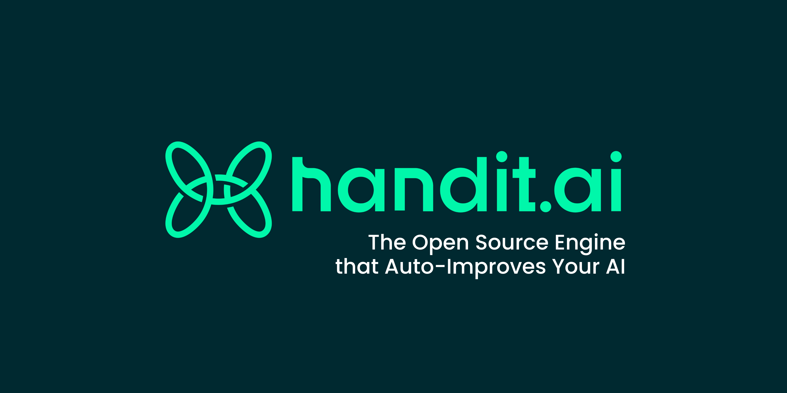

<p align="center">
  
</p>

>The Open Source Engine that Auto-Improves Your AI <br>
>Handit evaluates every agent decision, auto-generates better prompts and datasets, A/B-tests the fix, and lets you control what goes live.

---

## 🌟 What Handit Delivers

Handit gives you the tools to observe, evaluate, and improve every part of your LLM agents—node by node.

- 🔍 **Track Everything**  
  Capture all agent activity—inputs, outputs, tool calls, intermediate reasoning—across every node. Gain full visibility into how your agent actually behaves in production.

- 🧠 **Evaluate Automatically**  
  Use LLM-based evaluators to score each output. Assess quality, correctness, hallucination risk, and more at every step in your agent's execution graph.

- 💡 **Generate Insights**  
  Automatically detect failure patterns, drift, or low-performing prompts. Get actionable suggestions tied to specific parts of your agent.

- ✍️ **Version Prompts**  
  Track, compare, and roll back prompt changes. Version control is built into the system—by node, model, or project.

- 🔁 **Route Intelligently**  
  Serve the best prompt version dynamically via A2A-style routing. Optimize execution paths before they even run.

> If your agent is in production, Handit helps make sure it's actually working—and keeps getting better.

# ✨ Core Features

## Real-Time Monitoring

Continuously ingest logs from every model, prompt, and agent in your stack. Instantly visualize performance trends, detect anomalies, and set custom alerts for drift or failures—live.

Ready to evaluate your AI performance? Visit [Evaluation Hub](https://beta.handit.ai/ag-tracing)


<details>
<summary>✨ Benefits</summary>

### 🚀 Performance & Efficiency
- ⚡️ Ingest logs from models, prompts, and agents in seconds
- 📊 Visualize performance trends with interactive dashboards
- 🔍 Detect anomalies and drift automatically
- ⏰ Set custom real-time alerts for failures and threshold breaches

### 🎯 Quality & Control
- ✅ Execute LLM-as-Judge prompts on live traffic
- 📈 Enforce business KPI thresholds (accuracy, latency, etc.)
- 🎨 Receive automated quality scores in real time
- 🔄 Feed results directly into optimization workflows automatically

### 🛠️ Development & Management
- 🧪 Launch experiments across model versions, prompts, or agent configs
- 📈 Compare ROI metrics to identify top performers
- 🚀 Promote winning variants without manual effort
- 📚 Centralize prompt templates and version histories
- 🏷️ Tag, categorize, and collaborate on prompts
- 📊 Track prompt performance trends over time
- ⏪ Roll back or fork proven prompts instantly for quick iteration
</details>

## Evaluation

Run evaluation pipelines on production traffic with custom LLM-as-Judge prompts, business KPI thresholds (accuracy, latency, etc.), and get automated quality scores in real time. Results feed directly into your optimization workflows—no manual grading required.

Run your evaluations here: [Evaluation Hub](https://beta.handit.ai/evaluation-hub)


<details>
<summary>✨ Benefits</summary>

### 🎯 Quality & Control
- ✅ Execute LLM-as-Judge prompts on live traffic
- 📈 Enforce business KPI thresholds (accuracy, latency, etc.)
- 🎨 Receive automated quality scores in real time
- 🔄 Feed results directly into optimization workflows automatically

</details>

## Prompt Management, Self-Optimization, and AI CI/CD

- **Run experiments**  
  Test different model versions, prompts, or agent configurations with A/B traffic routing—no manual work required.

- **Automatically optimize**  
  Handit collects performance and ROI metrics in real time, then promotes the winning variant without human intervention.

- **Get the best prompt from Handit**  
  Compare prompt versions side-by-side, promote your favorite to production, and deploy it with a single click.

- **Collaborate and track**  
  Use built-in version control to manage templates, tag and categorize prompts, and view performance trends over time.


Run your prompt experiments and deployments here: [Prompt Versions](https://beta.handit.ai/prompt-versions)


<details>
<summary>✨ Benefits</summary>

### 🛠️ Development & Management
- 🧪 Launch experiments across model versions, prompts, or agent configs
- 📈 Compare ROI metrics to identify top performers
- 🚀 Promote winning variants without manual effort
- 📚 Centralize prompt templates and version histories
- 🏷️ Tag, categorize, and collaborate on prompts
- 📊 Track prompt performance trends over time
- ⏪ Roll back or fork proven prompts instantly for quick iteration

</details>


## 🔍 Core Tracing Methods

Both SDKs provide the same core tracing capabilities through different method signatures:

### Agent-Level Tracing

**Purpose:** Track complete AI agent workflows from start to finish

| **Method** | **Python** | **JavaScript** | **Use Case** |
|------------|------------|----------------|--------------|
| **Agent Wrapper** | `@start_agent_tracing()` | `startAgentTracing()` | Wrap entire agent functions for automatic tracing |
| **Manual Agent** | `_send_tracked_data()` | `captureAgentNode()` | Custom control over agent execution tracking |

### Function-Level Tracing

**Purpose:** Monitor individual components, tools, and LLM calls

| **Method** | **Python** | **JavaScript** | **Use Case** |
|------------|------------|----------------|--------------|
| **Node Decorator** | `@trace_agent_node()` | `traceAgentNode()` | Automatic tracing of specific functions |
| **Node Function** | `trace_agent_node_func()` | `captureAgentNode()` | Programmatic function tracing |
| **Model Tracking** | `track_model()` | `captureModel()` | LLM interaction monitoring |
| **Tool Tracking** | `track_tool()` | `trackTool()` | Custom tool and API call tracing |

### Configuration & Setup

**Purpose:** Initialize and configure SDK behavior

| **Method** | **Python** | **JavaScript** | **Use Case** |
|------------|------------|----------------|--------------|
| **Configuration** | `tracker.config()` | `config()` | Set API keys and SDK options |
| **Context Management** | `endAgentTracing()` | `endAgentTracing()` | Manual session management |

### Manual Tracing

**Purpose:** Fast integration ⚡️ and direct control over tracing operations

| **Method** | **Python** | **JavaScript** | **Use Case** |
|------------|------------|----------------|--------------|
| **Start Session** | `start_tracing()` | `startTracing()` | Start a new trace session |
| **End Session** | `end_tracing()` | `endTracing()` | End the current trace session |
| **Track Node** | `track_node()` | `trackNode()` | Record individual operations |
| **Track Model** | `track_model()` | `trackModel()` | Monitor LLM interactions |
| **Track Tool** | `track_tool()` | `trackTool()` | Track custom tool executions |

### Manual Tracing Parameters

| **Parameter** | **Type** | **Description** |
|---------------|----------|-----------------|
| `agent_name` | string | Name of your AI Application |
| `execution_id` | string | ID to link operations together |
| `node_name` | string | Unique identifier for the operation |
| `node_type` | string | Type of operation ("llm" or "tool") |
| `input` | object | Input data for the operation |
| `output` | object | Result of the operation |

## What Gets Tracked

### 🔄 Automatic Tracking
- **Agent Executions** - Complete workflow timing and status
- **Function Calls** - Input parameters and return values  
- **LLM Interactions** - Prompts, responses, token usage, and performance
- **Tool Usage** - Custom function executions and API calls
- **Error Handling** - Exception details and stack traces
- **Performance Metrics** - Execution time and resource usage

### 🎯 Custom Tracking
- **Business Events** - Domain-specific metrics and KPIs
- **User Context** - User IDs, session data, and custom metadata
- **External Services** - Third-party API calls and database queries
- **Conditional Logic** - Environment-based and user-tier tracking

## Key Capabilities by Use Case

### 🔍 **Debugging & Troubleshooting**
- **Complete execution traces** - See exactly what your agent did
- **Error context capture** - Full stack traces with input data
- **Performance bottleneck identification** - Find slow operations
- **Data flow visualization** - Track data transformations

### 📊 **Performance Monitoring**
- **Response time tracking** - Monitor agent and LLM latency
- **Resource usage monitoring** - Track memory and CPU usage
- **Token usage analysis** - Monitor LLM costs and efficiency
- **Success rate monitoring** - Track completion and failure rates

### 🎯 **Optimization & Insights**
- **Prompt performance analysis** - Compare different prompts
- **Model comparison** - Evaluate different LLM models
- **Tool effectiveness tracking** - Monitor tool success rates
- **User experience metrics** - Track user satisfaction indicators

### 🏗️ **Development & Testing**
- **Gradual rollout support** - Test new features safely
- **A/B testing integration** - Compare different approaches
- **Environment-specific tracking** - Different behavior per environment
- **Custom event tracking** - Monitor business-specific metrics


## SDK-Specific Features

### Python SDK Advantages
- **Deep Framework Integration** - Native LangChain and OpenAI support
- **Async/Await Support** - Full asynchronous operation tracking
- **Scientific Computing** - Integration with NumPy, Pandas, and ML libraries
- **Decorator Patterns** - Pythonic function decoration for tracing

### JavaScript SDK Advantages  
- **Modern JavaScript Support** - ES6+, TypeScript, and module systems
- **HTTP Library Integration** - Automatic Axios and Fetch tracking
- **Event-Driven Architecture** - WebSocket and event-based tracing
- **Microservice Ready** - Built for distributed Node.js applications

</br>

# ⚡️ Quickstart

## Overview: Tracing

Set up a fully observable AI Application

## Prerequisites

- A [Handit.ai Account](https://beta.handit.ai) (sign up if needed)
- 15-30 minutes to complete the setup

## Phase 1: AI Observability (5 minutes)


### Step 1: Install the SDK

```bash
# Python
pip install -U "handit-sdk>=1.16.0"

# JavaScript
npm install @handit.ai/node
```

### Step 2: Get Your Integration Token

1. Log into your [Handit.ai Dashboard](https://beta.handit.ai)
2. Go to **Settings** → **Integrations**
3. Copy your integration token

### Step 3: Add Basic Tracing

Set up your main agent function with tracing. You'll need to set up three key components:

>Python
1. Start tracing session with `start_tracing()`
2. Track operations with `track_node()`
3. End tracing session with `end_tracing()`

>JavaScript

1. Start tracing session with `startTracing()`
2. Track operations with `trackNode()`
3. End tracing session with `endTracing()`

#### Python Example

```python
# handit_service.py
from handit import HanditTracker
from langchain.chat_models import ChatOpenAI

class CustomerServiceAgent:
    def __init__(self):
        self.llm = ChatOpenAI(model="gpt-4")
        self.tracker = HanditTracker()
        self.tracker.config(api_key=os.getenv("HANDIT_API_KEY"))

    async def generate_response(self, user_message: str):
        prompt = f"Generate a helpful response to: {user_message}"
        try:
            response = await self.llm.agenerate([prompt])
            return response.generations[0][0].text
        except Exception as e:
            raise

    async def process_customer_request(self, user_message: str, execution_id: str):
        try:
            # Generate response
            response = await self.generate_response(user_message)
            
            # Track the response generation
            self.tracker.track_node(
                input=user_message,           # The original user message
                output=response,              # The generated response
                node_name="response_generator", # Unique identifier for this operation
                agent_name="customer_service_agent", # Name of this AI Application
                node_type="llm",              # Indicates this is a language model operation
                execution_id=execution_id     # Links this operation to the current trace session
            )
            
            return {"response": response}
            
        except Exception as e:
            raise

async def main():
    # Initialize the agent
    agent = CustomerServiceAgent()
    
    # Start a new trace session
    tracing_response = agent.tracker.start_tracing(
        agent_name="customer_service_agent"  # Identifies this agent in the Handit.ai dashboard
    )
    execution_id = tracing_response.get("executionId")  # Unique ID for this trace session
    
    try:
        # Process a customer request
        result = await agent.process_customer_request(
            user_message="I can't access my account",
            execution_id=execution_id
        )
        print(f"Response: {result['response']}")
    except Exception as e:
        print(f"Error processing request: {e}")
    finally:
        # End the trace session
        agent.tracker.end_tracing(
            execution_id=execution_id,           # The ID of the trace session to end
            agent_name="customer_service_agent"  # Must match the name used in start_tracing
        )
```

#### JavaScript Example

```javascript
// handit_service.js
import { config, startTracing, trackNode, endTracing } from '@handit.ai/node';
import { ChatOpenAI } from 'langchain/chat_models';

class CustomerServiceAgent {
    constructor() {
        this.llm = new ChatOpenAI({ model: 'gpt-4' });
        // Configure Handit.ai
        config({ apiKey: process.env.HANDIT_API_KEY });
    }

    async generateResponse(userMessage) {
        const prompt = `Generate a helpful response to: ${userMessage}`;
        try {
            const response = await this.llm.generate([prompt]);
            return response.generations[0][0].text;
        } catch (error) {
            throw error;
        }
    }

    async processCustomerRequest(userMessage, executionId) {
        try {
            // Generate response
            const response = await this.generateResponse(userMessage);
            
            // Track the response generation
            await trackNode({
                input: userMessage,           // The original user message
                output: response,             // The generated response
                nodeName: 'response_generator', // Unique identifier for this operation
                agentName: 'customer_service_agent', // Name of this AI Application
                nodeType: 'llm',              // Indicates this is a language model operation
                executionId                   // Links this operation to the current trace session
            });
            
            return { response };
            
        } catch (error) {
            throw error;
        }
    }
}

async function main() {
    // Initialize the agent
    const agent = new CustomerServiceAgent();
    
    // Start a new trace session
    const tracingResponse = await startTracing({ 
        agentName: 'customer_service_agent'  // Identifies this agent in the Handit.ai dashboard
    });
    const executionId = tracingResponse.executionId;  // Unique ID for this trace session
    
    try {
        // Process a customer request
        const result = await agent.processCustomerRequest(
            "I can't access my account",
            executionId
        );
        console.log('Response:', result.response);
    } catch (error) {
        console.error('Error processing request:', error);
    } finally {
        // End the trace session
        await endTracing({ 
            executionId,                         // The ID of the trace session to end
            agentName: 'customer_service_agent'  // Must match the name used in startTracing
        });
    }
}
```

> **Phase 1 Complete!** 🎉 You now have full observability with every operation, timing, input, output, and error visible in your dashboard.

> ## 📚 Want to Dive Deeper?
> 
> Explore our comprehensive documentation for advanced features and best practices:
> 
> ### 🔍 Core Features
> - [📖 Tracing Guide](https://docs.handit.ai/quickstart) - Master advanced tracing techniques
> - [🎯 Evaluation Guide](https://docs.handit.ai/evaluation/quickstart) - Learn about quality assessment
> - [⚡️ Optimization Guide](https://docs.handit.ai/optimization/quickstart) - Discover self-improvement features
> 
> ### 🤖 AI Advanced Features
> - [🔄 Self-Optimization](https://docs.handit.ai/optimization/optimization_features/self_improving_ai) - Automatically improve your AI models
> - [📝 Prompt Management](https://docs.handit.ai/optimization/optimization_features/ab_testing) - Version control and A/B testing for prompts
> - [🚀 AI CI/CD](https://docs.handit.ai/optimization/optimization_features/cicd_deployment) - Continuous integration for AI systems

---

## 📅 Roadmap

| Week | Focus                                               | Status         |
|------|------------------------------------------------------|----------------|
| 1    | Backend foundation + infrastructure                 | ✔️ Done |
| 2    | Prompt versioning + A2A routing logic               | ✔️ Done |
| 3    | Auto-evaluation + insight generation                | ✔️ Done |
| 4    | Deployment setup + UI + public release              | ✔️ Done |

---

## 🧪 Project Status

Handit is now open source and in active development!

This repo is live—but the full system is still under construction.  
Early adopters and contributors are welcome to **follow the build**, **open issues**, and **help shape what comes next**.

---

## 🚀 Getting Started

Handit is designed to be easy to run locally with Docker Compose. You can get both the backend (API) and frontend (dashboard) running with a single command.

### 1. Prerequisites
- [Docker](https://www.docker.com/get-started) & [Docker Compose](https://docs.docker.com/compose/)
- (Optional for advanced users) [Node.js](https://nodejs.org/) and [PostgreSQL](https://www.postgresql.org/)

### 2. Clone the Repository
```bash
git clone https://github.com/handit-ai/handit.ai.git
cd handit.ai
```

### 3. Environment Variables
Create a `.env` file in the root directory (or set the variables in your shell):
```
DB_USERNAME=your_db_user
DB_PASSWORD=your_db_password
DB_NAME=your_db_name
```
You can also add any other environment variables required by the API or dashboard.

### 4. Run in Development Mode
This uses `docker-compose.dev.yml` for hot-reloading and local development:
```bash
docker compose -f docker-compose.dev.yml up --build
```
- Frontend: [http://localhost:3000](http://localhost:3000)
- API: [http://localhost:3001/api](http://localhost:3001/api)
- Database: localhost:5432 (Postgres)
- Redis: localhost:6379

### 5. Run in Production Mode
This uses `docker-compose.yml` for a production-like environment:
```bash
docker compose -f docker-compose.yml up --build
```
- Frontend: [http://localhost:3000](http://localhost:3000)
- API: [http://localhost:3001/api](http://localhost:3001/api)

### 6. Manual Local Setup (Advanced)
If you want to run the backend and frontend separately (without Docker):
- Install dependencies in each app:
  ```bash
  cd apps/api && npm install
  cd ../dashboard && npm install
  ```
- Start Postgres and Redis locally, and set up your `.env` files.
- Run the backend:
  ```bash
  cd apps/api
  npm run dev
  ```
- Run the frontend:
  ```bash
  cd apps/dashboard
  npm run dev
  ```

---

## 📚 Documentation

- Docs and hosted playground coming soon  
- For updates, follow the creators:
  - [Cristhian Neira](https://www.linkedin.com/in/cristhian-neira)
  - [Oliver Tex](https://www.linkedin.com/in/oliver-tex/)
    
---

## ✏️ Contributing

Want to help build the future of LLM agent optimization?  
We'll soon add:

- `CONTRIBUTING.md`
- Open issues
- Early test environments
- Handit SDKs

Join the Discord and say hi: <a href="https://discord.gg/fnWyEC4t" target="_blank">https://discord.gg/fnWyEC4t</a>

---

## 👥 Contributors

Thanks to everyone helping bring Handit to life:

<a href="https://github.com/handit-ai/handit.ai/graphs/contributors">
  
</a>


> Want to appear here? Star the repo, follow along, and make your first PR 🙌

---

## 📄 License

MIT © 2025 – Built with 💡 by the Handit community


