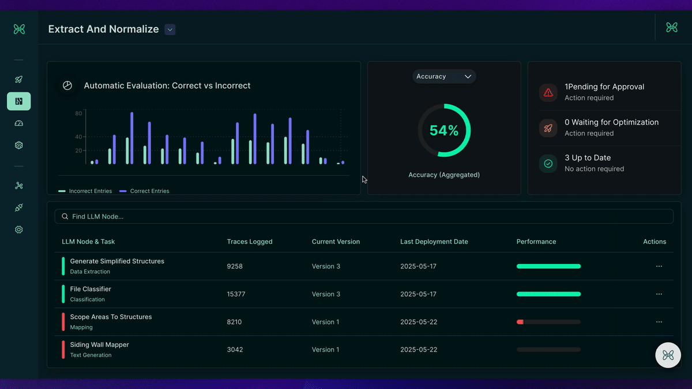
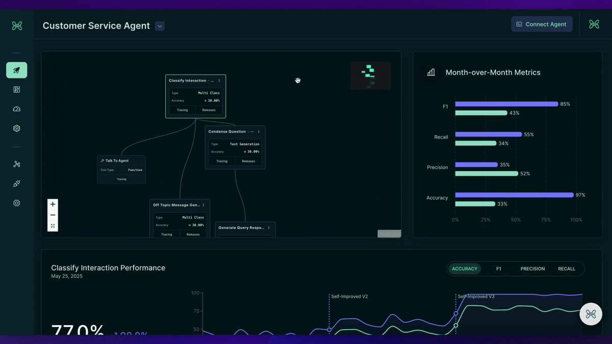
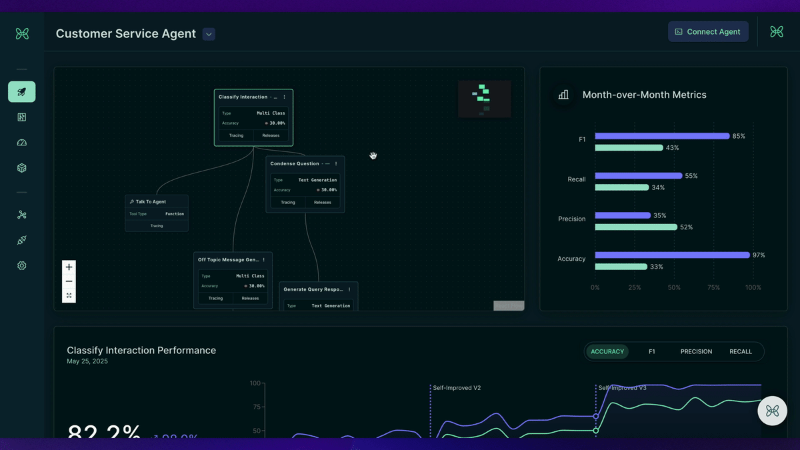
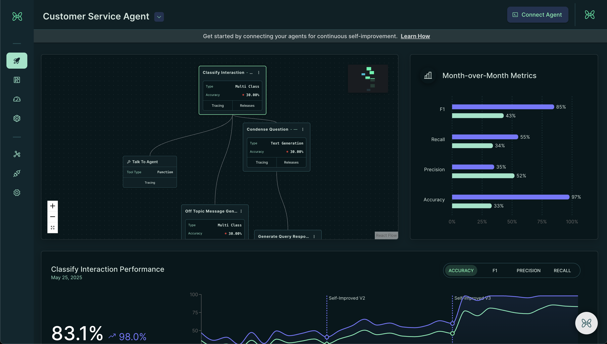
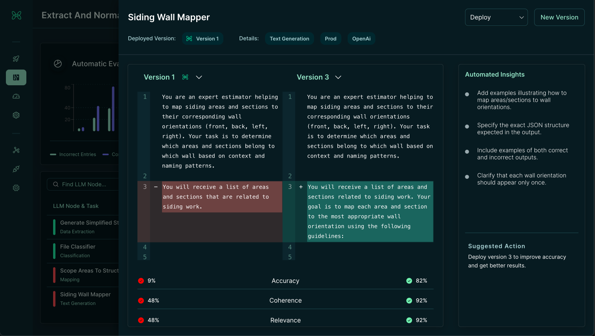

<p align="center">
  <!-- shows in LIGHT mode only -->
  
  <!-- shows in DARK mode only -->
  
</p>

<p align="center">
  <strong>🔥 The Open Source Engine that Auto-Improves Your AI 🔥</strong>
</p>

<p align="center">
  <a href="https://www.npmjs.com/package/@handit.ai/node">
    
  </a>
  <a href="https://pypi.org/project/handit-sdk/">
    
  </a>
  <a href="https://github.com/handit-ai/handit.ai/blob/main/LICENSE">
    
  </a>
  <a href="https://github.com/handit-ai/handit.ai">
    
  </a>
  <!-- TODO: Add Twitter handle when available -->
      <a href="https://discord.com/invite/XCVWYCFen6" target="_blank">
      
  </a>
</p>

<p align="center">
  <a href="https://docs.handit.ai/quickstart">🚀 Quick Start</a> •
  <a href="https://docs.handit.ai/">📋 Core Features</a> •
  <a href="https://docs.handit.ai/">📚 Docs</a> •
  <a href="https://calendly.com/cristhian-handit/30min">📅 Schedule a Call</a>
</p>

---

## 🎯 What is Handit?

Handit evaluates every agent decision, auto-generates better prompts and datasets, A/B-tests the fix, and lets you control what goes live.

This isn't another wrapper.  
This is the auto-improvement engine your agents have been missing.



### 🧱 The Auto-Improvement Philosophy

- **👁️ Complete Observability**: Track every step of your AI agents with comprehensive tracing. Monitor LLM calls, tool usage, execution timelines, and performance metrics in real-time across your entire agent workflow.
- **🔍 Evaluate Everything**: Automatically assess every agent decision—inputs, outputs, tool calls, and adherence to instructions—across every node. Detect issues, hallucinations, and performance gaps in real-time.
- **🤖 Auto-Generate Improvements**: Automatically get better prompts, based on detected issues. Let AI improve your AI with targeted fixes for specific failure patterns.
- **🧪 A/B Test Automatically**: Test improvements against your current setup with intelligent A/B testing. Compare performance, measure impact, and validate fixes before they go live.
- **🎛️ Control What Goes Live**: You decide what improvements to deploy. Review auto-generated fixes, approve changes, and roll back if needed. Full control over your agent's evolution.
- **✍️ Version Everything**: Track every change, improvement, and rollback. Complete version control for prompts, datasets, and configurations—by node, model, or project.

---

## 🚧 The Problem

AI agents in production suffer from **performance degradation**, **undetected failures**, and **manual optimization overhead**. Teams struggle with fragmented monitoring, manual prompt engineering, and lack of self improvement processes.

When you implement AI in critical business processes, you quickly realize you need to **understand what's happening with your AI** and ensure it **improves continuously**. But here's the challenge:

**Most teams don't see the problem until it's too late.** They're still early in their AI adoption curve, and by the time performance issues hit, they've already:

- ✋ Lost 6+ months troubleshooting mysterious failures
- 🔥 Shut down AI projects due to unpredictable behavior  
- 📉 Experienced performance degradation without knowing why

Instead of waiting for problems to surface, teams need a system that continuously monitors, evaluates, and optimizes their AI—**before** issues become critical.

---

## ✅ The Auto-Improvement System

Handit unifies your entire AI improvement pipeline into a **unified platform**. Monitoring, evaluation, optimization, and prompt management.

| **Before**                     | **After (Handit)**                      |
| ------------------------------ | --------------------------------------- |
| Manual performance monitoring  | **Automatic evaluation & insights**     |
| Fragmented optimization tools  | **End-to-end improvement pipeline**     |
| Manual prompt engineering     | **Auto-generated optimizations**        |
| No systematic A/B testing     | **Intelligent A/B testing**             |
| Performance degradation       | **Continuous Self-Improving AI**         |

---

## 🔧 Supported Features

| Feature                    | Status        | Use Case                                    |
| -------------------------- | ------------- | ------------------------------------------- |
| **Real-Time Monitoring**   | ✅ Available  | Track agent performance and detect issues   |
| **Evaluation Hub**         | ✅ Available  | Run evaluations             |
| **Prompt Management**      | ✅ Available  | Version control and A/B test prompts       |
| **Self-Improving AI**      | ✅ Available  | AI-generated improvements                   |
| **Token Usage Analytics**   | 🔄 Coming Soon| Monitor token consumption patterns |
| **Complete Cost Tracing**  | 🔄 Coming Soon| Monitor all costs of your LLMs             |

---

### 🤔 How it Works

Handit's architecture follows a proven 3-phase approach that transforms any AI system into a self-improving platform:

**Phase 1: Complete Observability**
- **Comprehensive Tracing**: Track every LLM call, tool usage, and execution step with detailed timing and error tracking
- **Real-Time Monitoring**: Instantly visualize all agent operations, inputs, outputs, and performance metrics

**Phase 2: Continuous Evaluation**  
- **LLM-as-Judge**: Automated quality assessment using custom evaluators across multiple dimensions (accuracy, completeness, coherence)
- **Quality Insights**: Real-time evaluation scores and trends to identify improvement opportunities

**Phase 3: Self-Improving AI**
- **Automatic Optimization**: AI generates better prompts based on evaluation data and performance patterns
- **Background A/B Testing**: Improvements are tested automatically with statistical confidence before deployment  
- **Release Hub**: Review, compare, and deploy optimized prompts with full control and easy rollback

This model means you no longer need to manually monitor, debug, and optimize your AI agents.

## ⚡ Core Features

The following features are deeply integrated to help you build continuously improving AI systems:

### 🔑 Real-Time Monitoring
Continuously ingest logs from every model, prompt, and agent in your stack. Instantly visualize performance trends, detect anomalies, and set custom alerts for drift or failures—live.

**Ready to monitor your AI?** → [Observability Dashboard](https://dashboard.handit.ai/ag-tracing)

### 📣 Evaluation Hub  
Run evaluation pipelines on production traffic with custom LLM-as-Judge prompts, business KPI thresholds (accuracy, latency, etc.), and get automated quality scores in real time. Results feed directly into your optimization workflows—no manual grading required.

**Ready to evaluate your AI?** → [Evaluation Hub](https://dashboard.handit.ai/evaluation-hub)

### 🏪 Prompt Management & Optimization
Version control your prompts while Handit automatically improves your AI through self-improving optimization. Generate better prompts, test them with intelligent A/B testing, and deploy proven improvements—all with full control over what goes live.

**Ready to optimize your AI Agents?** → [Prompt Versions](https://dashboard.handit.ai/prompt-versions)

### 📊 Auto-Generated Insights
<!-- TODO: Add more detailed information about insight generation capabilities -->
Handit automatically analyzes performance patterns and generates actionable insights for improvement.

### 📡 Version Control: Complete Traceability
Track every change, improvement, and rollback. Complete version control for prompts, datasets, and configurations—by node, model, or project.

### 👁️ End-to-End Observability with Traces
Every execution generates a full trace, capturing step timelines, model interactions, tool calls, and performance metrics. Visualize everything in the dashboard and debug faster.

---

## 🚀 Complete Handit.ai Quickstart

> **The Open Source Engine that Auto-Improves Your AI.** <br />
> Handit evaluates every agent decision, auto-generates better prompts and datasets, A/B-tests the fix, and lets you control what goes live.

**What you'll build:** A fully observable, continuously evaluated, and automatically optimizing AI system that improves itself based on real production data.

### Overview: The Complete Journey

Here's what we'll accomplish in three phases:

1. **[Phase 1: AI Observability](#phase-1-ai-observability-5-minutes)** ⏱️ 5 minutes - Set up comprehensive tracing to see inside your AI agents
2. **[Phase 2: Quality Evaluation](#phase-2-quality-evaluation-10-minutes)** ⏱️ 10 minutes - Add automated evaluation to continuously assess performance  
3. **[Phase 3: Self-Improving AI](#phase-3-self-improving-ai-15-minutes)** ⏱️ 15 minutes - Enable automatic optimization with proven improvements

**The Result**: Complete visibility into performance with automated optimization recommendations based on real production data.

### Prerequisites

- A [Handit.ai Account](https://dashboard.handit.ai/auth/custom/sign-in) (sign up if needed)
- 15-30 minutes to complete the setup

---

## Phase 1: AI Observability

Let's add comprehensive tracing to see exactly what your AI is doing.

### Python Example 

### Step 1: Install the SDK

```bash
# Python
pip install -U "handit-sdk>=1.16.0"

# JavaScript
npm install @handit.ai/node
```

### Step 2: Get Your Integration Token

1. Log into your [Handit.ai Dashboard](https://beta.handit.ai)
2. Go to **Settings** → **Integrations**
3. Copy your integration token



### Step 3: Add Basic Tracing

Set up your main agent function with four key components:

1. **Initialize Handit.ai service**
2. **Set up start tracing**
3. **Track LLM calls and tools in your workflow**
4. **Set up end tracing**

#### Python Example

Create a `handit_service.py` file:

```python
"""
Handit.ai service initialization and configuration.
"""
import os
from dotenv import load_dotenv
from handit import HanditTracker

load_dotenv()

# Create a singleton tracker instance
tracker = HanditTracker()
tracker.config(api_key=os.getenv("HANDIT_API_KEY"))
```

Main agent with comprehensive tracing:

```python
"""
Customer service agent with Handit.ai tracing.
"""
from handit_service import tracker
from langchain.chat_models import ChatOpenAI

class CustomerServiceAgent:
    def __init__(self):
        self.llm = ChatOpenAI(model="gpt-4")

    async def generate_response(self, user_message: str, context: dict, execution_id: str) -> str:
        """Generate response using LLM with context."""
        context_text = "\n".join([doc["content"] for doc in context["similar_documents"]])
        system_prompt = f"You are a helpful customer service agent. Use the provided context.\n\nContext: {context_text}"
        
        response = await self.llm.agenerate([system_prompt + "\n\nUser Question: " + user_message])
        generated_text = response.generations[0][0].text
        
        # Track the LLM call
        tracker.track_node(
            input={
                "systemPrompt": system_prompt,
                "userPrompt": user_message,
                "extraDetails": {
                    "model": "gpt-4",
                    "temperature": 0.7,
                    "context_documents": len(context["similar_documents"])
                }
            },
            output=generated_text,
            node_name="response_generator",
            agent_name="customer_service_agent",
            node_type="llm",
            execution_id=execution_id
        )
        
        return generated_text

    async def get_context_from_vector_db(self, query: str, execution_id: str) -> dict:
        """Tool function to extract context from vector database."""
        # Simulate semantic search results
        results = {
            "query": query,
            "similar_documents": [
                {
                    "content": "Our AI platform offers automated evaluation, optimization, and real-time monitoring.",
                    "similarity_score": 0.94,
                    "document_id": "features_001"
                }
            ]
        }
        
        # Track the tool usage
        tracker.track_node(
            input={
                "toolName": "get_context_from_vector_db",
                "parameters": {"query": query, "top_k": 2},
                "extraDetails": {"vector_db": "chroma", "collection": "company_knowledge"}
            },
            output=results,
            node_name="vector_context_retriever",
            agent_name="customer_service_agent",
            node_type="tool",
            execution_id=execution_id
        )
        
        return results

    async def process_customer_request(self, user_message: str, execution_id: str) -> dict:
        """Process customer request with full tracing."""
        context = await self.get_context_from_vector_db(user_message, execution_id)
        response = await self.generate_response(user_message, context, execution_id)
        return {"response": response}

# Usage example
async def main():
    agent = CustomerServiceAgent()
    
    # Start tracing
    tracing_response = tracker.start_tracing(agent_name="customer_service_agent")
    execution_id = tracing_response.get("executionId")
    
    try:
        result = await agent.process_customer_request(
            "What AI features does your platform offer?", execution_id
        )
        print(f"Response: {result['response']}")
    finally:
        # End tracing
        tracker.end_tracing(execution_id=execution_id, agent_name="customer_service_agent")
```

### JavaScript Example

```javascript
/**
 * Customer service agent with Handit.ai tracing.
 */
import { config, startTracing, trackNode, endTracing } from '@handit.ai/node';
import { ChatOpenAI } from 'langchain/chat_models';

// Configure Handit.ai
config({ apiKey: process.env.HANDIT_API_KEY });

class CustomerServiceAgent {
    constructor() {
        this.llm = new ChatOpenAI({ model: 'gpt-4' });
    }

    async generateResponse(userMessage, context, executionId) {
        const contextText = context.similarDocuments.map(doc => doc.content).join('\n');
        const systemPrompt = `You are a helpful customer service agent. Use the provided context.\n\nContext: ${contextText}`;
        
        const response = await this.llm.generate([systemPrompt + `\n\nUser Question: ${userMessage}`]);
        const generatedText = response.generations[0][0].text;
        
        // Track the LLM call
        await trackNode({
            input: {
                systemPrompt,
                userPrompt: userMessage,
                extraDetails: {
                    model: "gpt-4",
                    temperature: 0.7,
                    context_documents: context.similarDocuments.length
                }
            },
            output: generatedText,
            nodeName: 'response_generator',
            agentName: 'customer_service_agent',
            nodeType: 'llm',
            executionId
        });
        
        return generatedText;
    }

    async getContextFromVectorDb(query, executionId) {
        // Simulate semantic search
        const results = {
            query,
            similarDocuments: [{
                content: "Our AI platform offers automated evaluation, optimization, and real-time monitoring.",
                similarityScore: 0.94,
                documentId: "features_001"
            }]
        };
        
        // Track the tool usage
        await trackNode({
            input: {
                toolName: "get_context_from_vector_db",
                parameters: { query, top_k: 2 },
                extraDetails: { vector_db: "chroma", collection: "company_knowledge" }
            },
            output: results,
            nodeName: 'vector_context_retriever',
            agentName: 'customer_service_agent',
            nodeType: 'tool',
            executionId
        });
        
        return results;
    }

    async processCustomerRequest(userMessage, executionId) {
        const context = await this.getContextFromVectorDb(userMessage, executionId);
        const response = await this.generateResponse(userMessage, context, executionId);
        return { response };
    }
}

// Usage example
async function main() {
    const agent = new CustomerServiceAgent();
    
    // Start tracing
    const tracingResponse = await startTracing({ agentName: 'customer_service_agent' });
    const executionId = tracingResponse.executionId;
    
    try {
        const result = await agent.processCustomerRequest(
            "What AI features does your platform offer?", executionId
        );
        console.log('Response:', result.response);
    } finally {
        // End tracing
        await endTracing({ executionId, agentName: 'customer_service_agent' });
    }
}
```

**🎉 Phase 1 Complete!** You now have full observability with every operation, timing, input, output, and error visible in your dashboard.

---

## Phase 2: Quality Evaluation

Add automated evaluation to continuously assess quality across multiple dimensions.

### Step 1: Connect Evaluation Models

1. Go to **Settings** → **Model Tokens**
2. Add your OpenAI or other model credentials
3. These models will act as "judges" to evaluate responses


### Step 2: Create Focused Evaluators

Create separate evaluators for each quality aspect in **Evaluation** → **Evaluation Suite**:

**Example Evaluator 1: Response Completeness**
```
You are evaluating whether an AI response completely addresses the user's question.

Focus ONLY on completeness - ignore other quality aspects.

User Question: {input}
AI Response: {output}

Rate on a scale of 1-10:
1-2 = Missing major parts of the question
3-4 = Addresses some parts but incomplete
5-6 = Addresses most parts adequately  
7-8 = Addresses all parts well
9-10 = Thoroughly addresses every aspect

Output format:
Score: [1-10]
Reasoning: [Brief explanation]
```

**Example Evaluator 2: Accuracy Check**
```
You are checking if an AI response contains accurate information.

Focus ONLY on factual accuracy - ignore other aspects.

User Question: {input}
AI Response: {output}

Rate on a scale of 1-10:
1-2 = Contains obvious false information
3-4 = Contains questionable claims
5-6 = Mostly accurate with minor concerns
7-8 = Accurate information
9-10 = Completely accurate and verifiable

Output format:
Score: [1-10]
Reasoning: [Brief explanation]
```


### Step 3: Associate Evaluators to Your LLM Nodes

1. Go to **Agent Performance**
2. Select your LLM node (e.g., "response-generator")
3. Click **Manage Evaluators**
4. Add your evaluators



### Step 4: Monitor Results

View real-time evaluation results in:
- **Tracing** tab: Individual evaluation scores
- **Agent Performance**: Quality trends over time



**🎉 Phase 2 Complete!** Continuous evaluation is now running across multiple quality dimensions with real-time insights.

---

## Phase 3: Self-Improving AI

Enable automatic optimization that generates better prompts and provides proven improvements.

### Step 1: Connect Optimization Models

1. Go to **Settings** → **Model Tokens**
2. Select optimization model tokens
3. Self-improving AI automatically activates once configured


> **Automatic Activation**: Once optimization tokens are configured, the system automatically begins analyzing evaluation data and generating optimizations.

### Step 2: Monitor Optimization Results

The system is now automatically generating and testing improved prompts. Monitor results in two places:

**Agent Performance Dashboard**: 

- View agent performance metrics
- Compare current vs optimized versions
- See improvement percentages


**Release Hub**:

- Go to Optimization → Release Hub
- View detailed prompt comparisons
- See statistical confidence and recommendations



### Step 3: Deploy Optimizations

1. **Review Recommendations** in Release Hub
2. **Compare Performance** between current and optimized prompts
3. **Mark as Production** for prompts you want to deploy
4. **Fetch via SDK** in your application


**Fetch Optimized Prompts:**

```python
# Python
from handit import HanditTracker

tracker = HanditTracker(api_key="your-api-key")
optimized_prompt = tracker.fetch_optimized_prompt(model_id="response-generator")

# Use in your LLM calls
response = your_llm_client.chat.completions.create(
    model="gpt-4",
    messages=[
        {"role": "system", "content": optimized_prompt},
        {"role": "user", "content": user_query}
    ]
)
```

```javascript
// JavaScript
import { HanditClient } from '@handit/sdk';

const handit = new HanditClient({ apiKey: 'your-api-key' });
const optimizedPrompt = await handit.fetchOptimizedPrompt({ modelId: 'response-generator' });

// Use in your LLM calls
const response = await openai.chat.completions.create({
    model: 'gpt-4',
    messages: [
        { role: 'system', content: optimizedPrompt },
        { role: 'user', content: userQuery }
    ]
});
```

**🎉 Phase 3 Complete!** You now have a self-improving AI that automatically detects quality issues, generates better prompts, tests them, and provides proven improvements.

---

### What You've Accomplished

🎉 **Congratulations!** You now have a complete AI observability and optimization system:

- ✅ **Full Observability**: Complete visibility into operations with real-time monitoring
- ✅ **Continuous Evaluation**: Automated quality assessment across multiple dimensions  
- ✅ **Self-Improving AI**: Automatic optimization with AI-generated improvements and A/B testing

### Troubleshooting

**Tracing Not Working?**
- Verify your API key is correct and set as environment variable
- Ensure you're using the correct function parameters

**Evaluations Not Running?**
- Confirm model tokens are valid and have sufficient credits
- Verify LLM nodes are receiving traffic

**Optimizations Not Generating?**
- Ensure evaluation data shows quality issues (scores below threshold)
- Verify optimization model tokens are configured

**Need Help?** Join our [Discord community](https://discord.gg/wZbW9Bu5) or check [GitHub Issues](https://github.com/Handit-AI/handit.ai-docs/issues)

---

## 🌐 Language Support

Write your AI agents in your preferred language:

| Language       | Status        | SDK Package           |
| -------------- | ------------- | --------------------- |
| **Python**     | ✅ Stable      | [`handit-sdk>=1.16.0`](https://pypi.org/project/handit-sdk/)  |
| **JavaScript** | ✅ Stable      | [`@handit.ai/node`](https://www.npmjs.com/package/@handit.ai/node)     |
| **TypeScript** | ✅ Stable      | [`@handit.ai/node`](https://www.npmjs.com/package/@handit.ai/node)     |
| **Go**         | ✅ Available | HTTP API integration          |
| **Any Stack/Framework** | ✅ Available | HTTP API integration (n8n, Zapier, etc.) |
| **Java, C#, Ruby, PHP** | ✅ Available | REST API integration |
| **LangChain & LangGraph** | ✅ Available | Python/JS SDK |
| **LlamaIndex, AutoGen** | ✅ Available | Python/JS SDK + HTTP API |
| **CrewAI, Swarm** | ✅ Available | Python SDK + HTTP API |

---

### 💬 **Get Help**
- **📋 Questions**: Use our [Discord community](https://discord.com/invite/XCVWYCFen6)
- **🐛 Bug Reports**: [GitHub Issues](https://github.com/handit-ai/handit.ai/issues)
- **📖 Documentation**: [Official Docs](https://docs.handit.ai)
- **📅 Schedule a Call**: [Book a Demo](https://calendly.com/cristhian-handit/30min)

### 🤝 **Contributing**

#### 🚀 Roadmap

We're building Handit in the open, and we'd love for you to be a part of the journey.

| Week | Focus                                               | Status         |
|------|------------------------------------------------------|----------------|
| 1    | Backend foundation + infrastructure                 | ✔️ Done |
| 2    | Prompt versioning              | ✔️ Done |
| 3    | Auto-evaluation + insight generation                | ✔️ Done |
| 4    | Deployment setup + UI + public release              | ✔️ Done |

We welcome contributions! Whether it's:
- 🐛 Bug fixes and improvements
- ✨ New features
- 📚 Documentation and examples
- 🌍 Language support additions
- 🎨 Dashboard UI enhancements

---

## 👥 Contributors

Thanks to everyone helping bring Handit to life:

<a href="https://github.com/handit-ai/handit.ai/graphs/contributors">
  
</a>


> Want to appear here? Star the repo, follow along, and make your first PR 🙌

---
<div align="center">

**🌟 Ready to auto-improve your AI?**

[🚀 **Get Started Now**](https://www.handit.ai/) • [📖 **Read the Docs**](https://docs.handit.ai/quickstart) • [💬 **Join Discord**](https://discord.com/invite/XCVWYCFen6) • [📅 **Schedule a Call**](https://calendly.com/cristhian-handit/30min)

</div>

---
<div align="center">

[](https://www.star-history.com/#handit-ai/handit.ai&Date)

<sub>Built with ❤️ by the Handit team • **Star us if you find Handit useful!** ⭐</sub>

</div>

---

## 📄 License

MIT © 2025 – Built with 💡 by the Handit community


